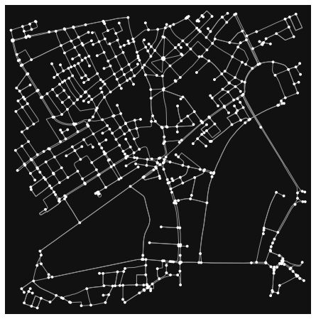

# Display Street Network Map using OSMnx

In this example, we will use Python and OSMnx library to open and visualize a street network map.

```python

# Import necessary libraries
import osmnx as ox

# Define a location (e.g., a city or an area) for which you want to retrieve the street network
place_name = "London,UK"

# Fetch the street network data using OSMnx
graph = ox.graph_from_place(place_name, network_type="drive", dist=1000)

# Plot the street network
ox.plot_graph(ox.project_graph(graph))
```


