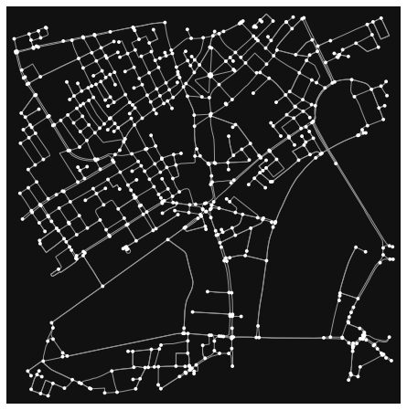

```python
import osmnx
```


```python

# Import necessary libraries
import osmnx as ox

# Define a location (e.g., a city or an area) for which you want to retrieve the street network
place_name = "London,UK"


```


```python
# Fetch the street network data using OSMnx
graph = ox.graph_from_address(place_name, network_type="drive", dist=1000)


```


```python
# Plot the street network
ox.plot_graph(ox.project_graph(graph))

```


    

    


    (<Figure size 576x576 with 1 Axes>, <AxesSubplot:>)


```python
#ox.explore(ox.project_graph(graph))

```


```python

```
